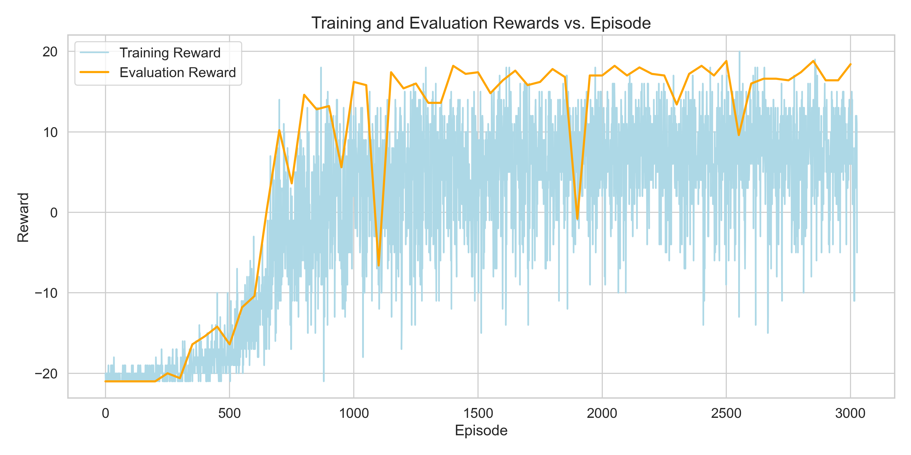

# Deep Q-Network (DQN) Implementation for Pong

<p align="center">
  
</p>
This repository contains an implementation of the Deep Q-Network (DQN) algorithm applied to the classic Atari game Pong. The DQN algorithm, introduced by Mnih et al. in 2015, combines Q-learning with deep neural networks to enable agents to learn control policies directly from high-dimensional sensory inputs. ([Read the paper](https://storage.googleapis.com/deepmind-media/dqn/DQNNaturePaper.pdf))

---

## Project Structure

```
DQN-Pong/
├── README.md                 # Project overview and instructions
├── requirements.txt          # List of dependencies
├── config/
│   ├── __init__.py           # Marks the directory as a Python package
│   └── pong_config.py        # Configuration settings
├── models/
│   ├── __init__.py           # Marks the directory as a Python package
│   ├── dqn_model.py          # Defines the DQN architecture
│   └── replay_memory.py      # Implements replay memory
├── utils/
│   ├── __init__.py           # Marks the directory as a Python package
│   ├── helpers.py            # Additional utility functions
│   └── optimize.py           # Optimization routines
├── scripts/
│   ├── train.py              # Script for training the DQN agent
│   ├── evaluate.py           # Script for evaluating the trained model
│   └── plot_results.py       # Script for plotting training/evaluation metrics
├── logs/
│   └── training.log          # Log file for tracking training progress
├── videos/
│   └── best_video.mp4        # Video of the trained agent playing Pong
└── images/
    └── training_rewards.png  # Plot of rewards over episodes
```

---

## Getting Started

### Prerequisites

Ensure you have Python 3.8 or higher installed. Install the required dependencies using `pip`:

```bash
pip install -r requirements.txt
```

---

### Training the Agent

To train the DQN agent on Pong, run:

```bash
python3 scripts/train.py
```

This script will train the agent and save the best-performing model weights in the `models/` directory.

---

### Evaluating the Agent

To evaluate the performance of the trained agent, run:

```bash
python3 scripts/evaluate.py --model-path models/best_model.pth
```

Replace `best_model.pth` with the filename of your saved model weights. The script will play the game using the trained agent, display its performance, and save a video in the `videos/` directory.

---

## Results

### Training Performance

The plot below shows the agent's reward progression over training episodes. Reward to between -21 and 21, with around 15 being considered human performance. It was trained for 3000 episodes, which corresponds to almost 10 days of gameplay, and managed a peak of 18.8 mean reward:




---

## References

Mnih, V., Kavukcuoglu, K., Silver, D., Rusu, A. A., Veness, J., Bellemare, M. G., ... & Hassabis, D. (2015). Human-level control through deep reinforcement learning. *Nature*, 518(7540), 529-533. ([Read the paper](https://storage.googleapis.com/deepmind-media/dqn/DQNNaturePaper.pdf))

---

## License

This project is licensed under the MIT License. See the [LICENSE](LICENSE) file for details.
